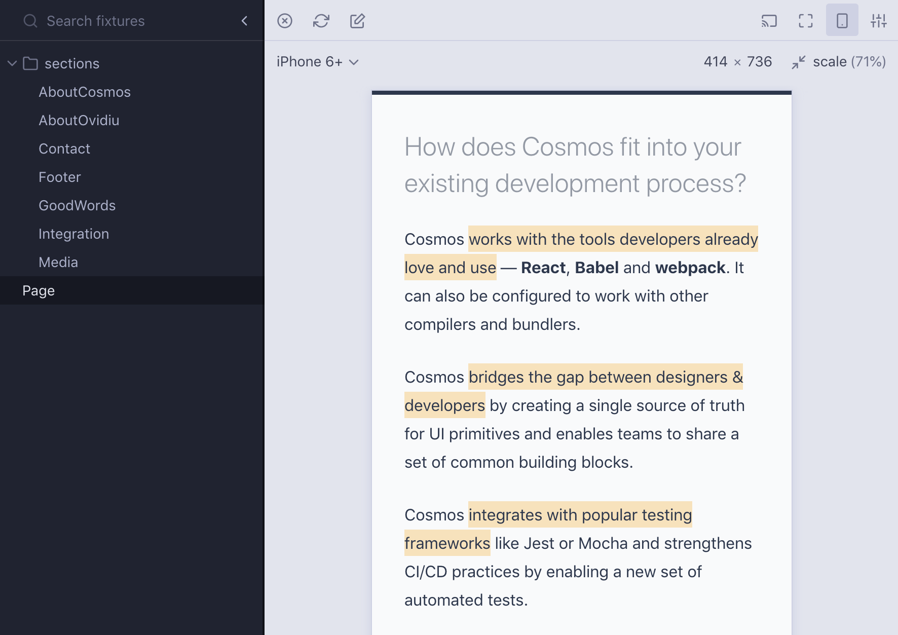

# Welcome to future of React Cosmos! 🎉

> Latest update: [Cosmos 4.8 — the version that keeps on giving](https://medium.com/@skidding/cosmos-4-8-the-version-that-keeps-on-giving-746d6265f81d)

**Install `react-cosmos@next` to get started.**



The [example package](example) is a useful complement to this guide.

## Config

No config is required to start. If you have custom needs or would like to convert a Cosmos Classic config, here's what you need to know.

The Cosmos Next config is a **JSON** file, so it can only host serializable values. This design decision is meant to discourage complex configuration, make it easy to embed config options into the UI, and enable visual config management in the future.

By default, Cosmos reads `cosmos.config.json` from your root directory. You can pass a `--config` CLI arg for a custom config path.

> Most Cosmos Classic config options are still supported in the new JSON format. [Let me know](https://join-react-cosmos.now.sh/) if you need old config options that no longer work.

## Webpack

Configuring webpack is the least romantic aspect of the Cosmos setup. Luckily, you only do it once. Depending on your setup, one of the following options will work for you.

### Default webpack config

In many cases Cosmos manages to get webpack working without human intervention. Try running Cosmos as is first.

### Custom webpack config

Probably the most common scenario. Most of us end up with a hairy webpack config sooner or later. Use the `webpack.configPath` setting to point to an existing webpack config.

You can also point to a module inside a dependency, like in the following Create React App example.

```json
{
  "webpack": {
    "configPath": "react-scripts/config/webpack.config"
  }
}
```

### Webpack config override

Overriding the webpack config gives you complete control. Use the `webpack.overridePath` setting to point to a module that customizes the webpack config used by Cosmos.

```json
{
  "webpack": {
    "overridePath": "./webpack.override.js"
  }
}
```

The override function receives a base webpack config — the default one generated by Cosmos or a custom one loaded from `webpack.configPath`. Extend the input config and return the result.

```js
// webpack.override.js
module.exports = (webpackConfig, env) => {
  return { ...webpackConfig /* do your thing */ };
};
```

## JSX fixtures

Cosmos Next introduces a more natural format for component fixtures: **React elements.**

> Think of JSX fixtures as the return value of a render function, or the first argument to `React.render`.

```jsx
// __fixtures__/disabled.js
export default <Button disabled>Click me</Button>;
```

The JSX fixture format has a few advantages compared to the old format:

- Fixtures are no longer bound to a single component
- Adding one or more component wrappers per fixture is easy
- Fixtures can be copy pasted inside the project source code
- Props are easier to type-check
- Writing fixtures doesn't feel like writing code for Cosmos

The JSX fixture format also comes with a minor drawback: `React` must be imported in every fixture file.

## How to create fixture files

Two options:

1. End fixture file names with `.fixture.{js,jsx,ts,tsx}`
2. Put fixture files inside `__fixtures__`

Examples:

1. `blankState.fixture.js`
2. `__fixtures__/blankState.js`

> File name conventions can be configured using the `fixturesDir` and `fixtureFileSuffix` options.

## Multi fixture files

A fixture file can also export multiple fixtures if the default export is an object.

```jsx
// buttons.fixture.js
export default {
  primary: <PrimaryButton>Click me</PrimaryButton>,
  primaryDisabled: <PrimaryButton disabled>Click me</PrimaryButton>,
  secondary: <SecondaryButton>Click me</SecondaryButton>,
  secondaryDisabled: <SecondaryButton disabled>Click me</SecondaryButton>
};
```

The object property names will show up as fixture names in the Cosmos UI.

> [See this comment](https://github.com/react-cosmos/react-cosmos/issues/924#issuecomment-462082405) for the reasoning behind this solution (vs named exports).

## Decorators

Wrapping components inside fixtures is now easy, but can become repetitive. _Decorators_ can be used to apply one or more component wrappers to a group of fixtures automatically.

A `cosmos.decorator` file looks like this:

```jsx
// cosmos.decorator.js
export default ({ children }) => <Provider store={store}>{children}</Provider>;
```

> A decorator file only applies to fixture files that are contained in the decorator file's directory. Multiple decorator files can be composed, in the order of their position in the file system hierarchy (from outer to inner).

### Redux state mock

Check out [react-cosmos-redux](https://github.com/skidding/react-cosmos-redux) to see what a Cosmos Next decorator looks like. It works with the latest `react-redux` version and it's written in _Hooks_ 💃.

## UI plugins

A main feature of the Cosmos Next redesign is the brand-new UI plugin architecture. While the new UI is created 100% from plugins, the plugin API is not yet documented nor made accessible. It will take a few big steps to get there, but this is the future.

While we get feedback for the new JSX fixtures and decorators, I will continue to add feature parity with the old Cosmos UI and gradually release the powerful plugin API for mass consumption. Exciting things ahead!

## Where is my old Cosmos?

Cosmos Classic isn't going anywhere. First, it will take months before a release candidate for v5 (Cosmos Next) is ready. Second, the classic packages have been moved to [a dedicated repo](https://github.com/react-cosmos/react-cosmos-classic), which means we can continue to maintain Cosmos Classic or even run it alongside Cosmos Next in the same project (during the migration period).

---

**Thanks for your help in shaping the future of React Cosmos! 🙏**

For feedback [create a GitHub issue](https://github.com/react-cosmos/react-cosmos/issues/new) or [go on Slack](https://join-react-cosmos.now.sh/).
