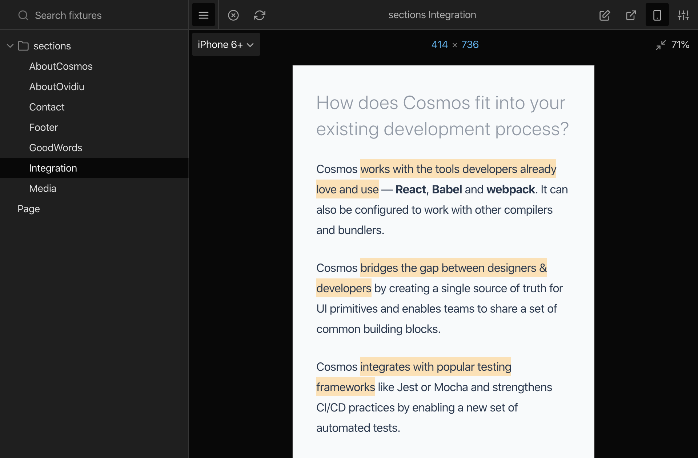

  
  <h1 align="center">React Cosmos</h1>

  
  
  
  
  
  

## Getting Started

> **Note** React Server Components are now supported! Check out the [Next.js integration](docs/getting-started/next.md) to get started.

Choose one of the [Getting Started](docs/README.md#getting-started) guides to dive into React Cosmos.

Visit [docs/README.md](docs/README.md) to view the full documentation.

## Community

To chat with other community members you can join the [React Cosmos Discord](https://discord.gg/3X95VgfnW5).

You can also ask questions, voice ideas, and share your projects on [GitHub Discussions](https://github.com/react-cosmos/react-cosmos/discussions).

Our [Code of Conduct](CODE_OF_CONDUCT.md) applies to all React Cosmos community channels.

## Contributing

Please see our [Contributing Guide](CONTRIBUTING.md).

Support the ongoing development of React Cosmos by becoming a [Sponsor](https://github.com/users/skidding/sponsorship).

## Live Demo

Visit [reactcosmos.org/live-demo](https://reactcosmos.org/live-demo/) for a live demo.

