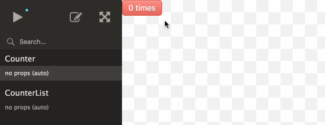

<p align="center">
  
</p>

<p align="center">
  <strong>React Cosmos</strong> ✭ Dev tool for creating reusable <a href="http://facebook.github.io/react/">React</a> components
</p>

<p align="center">
  <a href="https://travis-ci.org/react-cosmos/react-cosmos">
    
  </a>
  <a href="https://coveralls.io/r/react-cosmos/react-cosmos?branch=master">
    
  </a>
  <a href="https://join-react-cosmos.now.sh/">
    
  </a>
  <a href="CONTRIBUTING.md#how-to-contribute">
    
  </a>
</p>

Cosmos scans your project for components and enables you to:

1. Render components under any combination of props, context and state
2. Mock *every* external dependency (eg. API responses, localStorage, etc)
3. See app state evolve in real-time while interacting with running
instances



> Working with Cosmos improves component design because it surfaces dependencies. Cosmos forces us to define sane component inputs, making our UIs predictable and easier to debug down the road.

Read the story of React Cosmos: [Fighting for Component Independence](https://medium.com/@skidding/fighting-for-component-independence-2a762ee53272)

## Why Cosmos?

Many other component explorers emerged in the past years. [Storybook](https://github.com/storybooks/storybook) and [React Styleguidist](https://github.com/styleguidist/react-styleguidist) are good examples, but you can find an extensive list of options [here](https://react-styleguidist.js.org/docs/cookbook.html#are-there-any-other-projects-like-this). To decide which tool is best for you check for each project's goals, how much they match your needs, and how well the project is maintained.

**Cosmos is a dev tool first, made to improve *all* components, big and small, not just the stateless UI bits.** The [fixture](#fixtures) and [proxy](#proxies) architecture doubles as an [automated testing utility](#experimental-test-helpers), providing a complete solution for developing robust and reusable components. Cosmos also makes it easy to create a living style guide, but it's a secondary goal and you might get more value from alternatives if this is your chief concern.

To find out more about the Cosmos project, check out [Mission](CONTRIBUTING.md#mission), [Goals](CONTRIBUTING.md#goals) and [Architecture](CONTRIBUTING.md#architecture).

## Usage

Requirements:

- [x] React >=0.14.9
- [x] webpack or Browserify (or roll your own integration)
- [ ] [Fixtures](#fixtures) (you'll create them after getting started)

React Cosmos works best with webpack. Making it work with other bundlers takes extra work, but a complete [Browserify example](examples/browserify) is available.

Jump to:

- **[Getting started](#getting-started)**
- [Fixtures](#fixtures)
  - [What's a fixture?](#whats-a-fixture)
  - [Where to put fixtures?](#where-to-put-fixtures)
  - [Props](#props)
  - [Children](#Children)
  - [State](#state)
- [Proxies](#proxies)
  - [What's a proxy?](#whats-a-proxy)
  - [Where to put proxies?](#where-to-put-proxies)
  - [Redux](#redux)
  - [Context](#context)
  - [XHR](#xhr)
  - [Fetch](#fetch)
  - [React Router](#react-router)
- [Integration with popular tools](#integration-with-popular-tools)
  - [Create React App](#create-react-app)
  - [Next.js](#nextjs)
  - [React Redux Starter Kit](#react-redux-starter-kit)
- [Configuration](#configuration)
  - [Loader index.html](#loader-indexhtml)
  - [Custom config path](#custom-config-path)
  - [Custom component paths](#custom-component-paths)
  - [Option dump](#option-dump)
- [Exporting](#exporting)
- [Experimental: Test helpers](#experimental-test-helpers)
  - [Global Jest snapshot](#global-jest-snapshot)

*Have a question or idea to share? See you on [Slack](https://join-react-cosmos.now.sh/).*

### Getting started

```bash
npm install --dev react-cosmos-webpack
# or
yarn add --dev react-cosmos-webpack
```

Create `cosmos.config.js` in your project root

```js
module.exports = {
  componentPaths: ['src/components'],
  // Optionally, reuse loaders and plugins from your existing webpack config
  webpackConfigPath: './config/webpack.config.dev'
};
```

Add script to package.json

```js
"scripts": {
  "cosmos": "NODE_ENV=development cosmos"
}
```

Run `npm run cosmos` or `yarn cosmos` and go to [localhost:8989](http://localhost:8989) 🎉

#### Next steps

- See [popular integrations](#integration-with-popular-tools) (e.g. CRA or Next.js)
- Extend your [config](#configuration)
- Create [fixtures](#fixtures)
- Configure or create [proxies](#proxies) (e.g. Redux)
- Be kind and [report what went wrong](https://github.com/react-cosmos/react-cosmos/issues)

### Fixtures

#### What's a fixture?

A fixture a JS object used to mock component input and external dependencies. The input can be [props](#props), [children](#children), [state](#state) and [context](#context). With the help of [proxies](#proxies), fixtures can mock anything else a component depends on, from API responses to localStorage to window size.

```js
export default {
  props: {
    value: 'Lorem ipsum',
    disabled: true,
    onChange: value => console.log(`Select: ${value}`)
  }
}
```

> Check out this [quick hack](docs/fixtures.md) for getting started with fixtures.

#### Where to put fixtures?

Cosmos looks for `__fixtures__` dirs next to your components. Here are a few of the supported patterns.

##### Flat hierarchy

```bash
components/Button.jsx
components/nested/Dropdown.jsx
components/__fixtures__/Button/default.js
components/__fixtures__/Button/disabled.js
components/__fixtures__/nested/Dropdown/default.js
components/__fixtures__/nested/Dropdown/open.js
```

##### Nested hierarchy

```bash
components/Button/index.jsx
components/Button/__fixtures__/default.js
components/Button/__fixtures__/disabled.js
components/nested/Dropdown/index.jsx
components/nested/Dropdown/__fixtures__/default.js
components/nested/Dropdown/__fixtures__/open.js
```

Named component files also work in the nested hierarchy (i.e. `Button/Button.jsx` and `nested/Dropdown/Dropdown.jsx`).

#### Props

Mocking props is the most basic thing a fixture can do.

```js
export default {
  props: {
    loggedIn: true,
    user: {
      name: 'Dan the Man'
    }
  }
}
```

#### Children

Composition is the name of the game and many React components expect [children](https://facebook.github.io/react/docs/jsx-in-depth.html#children-in-jsx). Components access them via `props.children`, but children are not quite *props* so we put them under `fixture.children`.

```jsx
export default {
  children: (
    <div>
      <p>Fixture ain't afraid of JSX</p>
      <p>Fixture ain't afraid of nothin!</p>
    </div>
  )
}
```

#### State

Mocking state is where things get interesting. [Component state](https://facebook.github.io/react/docs/react-component.html#state) is private IRL, but Cosmos allows us to inject it and simulate all the various states a component can find itself in.

```js
export default {
  state: {
    searchQuery: 'Who let the dogs out?'
  }
}
```

### Proxies

#### What's a proxy?

Proxies are Cosmos plugins, allowing fixtures to go beyond mocking *props* and *state*.

We've seen `component = f(props, state)` a hundred times–the seductive promise of React and libs alike. **In reality, however, it's more like `component = f(props, state, context)` and most components are *nothing* without the context part.** This is still an oversimplification. The ugly truth is components take input from many other places: API responses, localStorage and window size to name a few.

But we know developing components in isolation is *The Way*, so intricate inputs won't stop us! With proxies, we look the devil in the eye and mock anything components depend on. Hell, we might even simplify our components once we're aware of all the crazy things they need to work.

How do proxies work? Well duh, they're *Just Components*. As regular React components, proxies compose in the order they are listed in your config and decorate the loaded component, respecting the contract to render the next proxy in the chain. They can be stateless or have a life cycle, mocking before mounting and unmocking before unmounting.

Proxies have two parts:

1. **Configuration.** Done once per project, inside [cosmos.proxies.js](#where-to-put-proxies). Some proxies might not require any options so it's just a matter of adding a package name to a list (similar to Babel plugins).
2. **Activation**. Triggered by a special fixture attribute. Eg. The React Router proxy activates when `fixture.url` is defined, otherwise it's a noop. Proxies can also be always-active, but it's a best practice to make proxies opt-in to avoid useless overhead.

#### Where to put proxies?

As soon as you're ready to add proxies to your Cosmos setup, create `cosmos.proxies.js` (next to cosmos.config.js) and export a list of proxies in the order they should load–from outermost to innermost. Here's an example with two standard proxies and a custom one:

```js
// cosmos.proxies.js
const ComponentHugger = props => {
  const { value: NextProxy, next } = props.nextProxy;
  return (
    <🐻🤗>
      <NextProxy {...props} nextProxy={next()} />
    </🐻🤗>
  );
};

// We ensure a specific proxy order
export default [
  // We can reference proxy packages when relying on defaults
  'react-cosmos-router-proxy',
  'react-cosmos-fetch-proxy',
  ComponentHugger
];
```

Jump to:
- [Context](#context)
- [Redux](#redux)
- [React Router](#react-router)
- [Fetch](#fetch)
- [XHR](#xhr)

#### Redux

Most components in a [Redux](http://redux.js.org/) app depend on Redux state–either they're a *container* or one of their descendants is. This proxy creates the store context required for any component you load, just like a [Provider](http://redux.js.org/docs/basics/UsageWithReact.html#passing-the-store).

Writing Redux fixtures almost feels too easy. Because Redux state is global, once you have one state mock you can render any component you want!

##### Configuration

```js
// cosmos.proxies.js
import createReduxProxy from 'react-cosmos-redux-proxy';

const ReduxProxy = createReduxProxy({
  // Called when fixture loads with fixture.reduxState as initial state
  createStore: (initialState) => {
    return Redux.createStore(yourReducer, initialState, yourMiddleware);
  },
});

export default [
  ReduxProxy,
  // ...other proxies
];
```

##### Activation

```js
// __fixtures__/example.js
export default {
  // An empty object will populate the store with the initial state
  // returned by reducers. But we can also put any state we want here.
  reduxState: {}
}
```

#### Context

[React Context](https://facebook.github.io/react/docs/context.html): *With great power comes great responsibility.*

> Note: React doesn't recommend using *context* unless you're a lib, so most of us don't need this proxy either.

##### Configuration

```js
// context-proxy.js
import createContextProxy from 'react-cosmos-context-proxy';

const ContextProxy = createContextProxy({
  // Expects fixture.context to contain `theme` object (see examples/context)
  childContextTypes: {
    theme: PropTypes.object.isRequired,
  },
});

export default [
  ContextProxy,
  // ...other proxies
];
```

##### Activation

```js
// __fixtures__/example.js
export default {
  theme: {
    backgroundColor: '#f1f1f1',
    color: '#222'
  }
}
```

#### XHR

Besides client-side state, components also depend on external data. Mocking server responses allows us to completely isolate our components.

##### Configuration

```js
// cosmos.proxies.js
export default [
  'react-cosmos-xhr-proxy',
  // ...other proxies
]
```

##### Activation

```js
// __fixtures__/example.js
export default {
  xhr: [
    {
      url: '/users',
      response: (req, res) =>
        res.status(200).body([
          {
            id: 1,
            name: 'Blossom',
          },
          {
            id: 2,
            name: 'Bubbles',
          },
          {
            id: 3,
            name: 'Buttercup'
          }
        ]),
    },
  ],
};
```

The proxy is a thin layer on top of the [xhr-proxy](https://github.com/jameslnewell/xhr-mock) utility. Check out the [Axios example](examples/axios) to see it in action.

#### Fetch

Like the [XHR](#xhr) proxy, but for the *Fetch API*.

##### Configuration

```js
// cosmos.proxies.js
export default [
  'react-cosmos-fetch-proxy',
  // ...other proxies
]
```

##### Activation

```js
// __fixtures__/example.js
export default {
  fetch: [
    {
      matcher: '/users',
      response: [
        {
          id: 1,
          name: 'Prabu',
        },
        {
          id: 2,
          name: 'Karla',
        },
        {
          id: 3,
          name: 'Linbaba'
        }
      ],
    },
  ]
};
```

Built on top of [fetch-mock](http://www.wheresrhys.co.uk/fetch-mock/api). Check out the [Fetch example](examples/fetch) to see `react-cosmos-fetch-proxy` in action.

#### React Router

> Warning: react-cosmos-router-proxy is designed for React Router **v4** and above

[React Router](https://reacttraining.com/react-router/) is used in most React projects. Wrapping components with `withRouter` makes the Router context an implicit dependency–one we need to mock.

##### Configuration

```js
// cosmos.proxies.js
export default [
  'react-cosmos-router-proxy',
  // ...other proxies
]
```

##### Activation

Simply adding a `url` to your fixture will wrap the loaded component inside a [Router](https://reacttraining.com/react-router/core/api/Router).

```js
// __fixtures__/example.js
export default {
  url: '/about'
}
```

Optionally, `route` can be added to also wrap the loaded component inside a [Route](https://reacttraining.com/react-router/core/api/Route).

```js
// __fixtures__/example.js
export default {
  url: '/users/5',
  route: '/users/:userId'
}
```

Check out the [React Router example](examples/react-router) to see proxy in action.

*What proxy would you create to improve DX?*

### Integration with popular tools

#### Create React App

It's preferred to use CRA's own webpack config (instead of duplicating it).

```js
// cosmos.config.js
module.exports = {
  componentPaths: ['src/components'],
  containerQuerySelector: '#root',
  webpackConfigPath: 'react-scripts/config/webpack.config.dev',
  publicPath: 'public'
};
```

Also make sure to:
- Run `cosmos` with `NODE_ENV=development`
- Create the `src/components` directory and place your components there, or change componentPaths option to match your existing structure
- Put [proxies](#proxies) in the `src` dir–the only place included by the CRA Babel loader

*CRA + Cosmos example: [Flatris](https://github.com/skidding/flatris)*

#### Next.js

Next.js apps run on both client & server, so compilation is done via Babel plugins instead of webpack loaders. This means we can rely on Cosmos' default webpack config.

```js
// cosmos.config.js
module.exports = {
  componentPaths: ['components'],
  publicPath: 'static',
  publicUrl: '/static/',
};
```

Also make sure to:
- Add `html-webpack-plugin` to your dev dependencies
- Define `.babelrc` for the Cosmos webpack config to rely on the Next.js preset:

```json
{
  "presets": ["next/babel"],
}
```

*Next.js + Cosmos example: [Illustrated Algorithms](https://github.com/skidding/illustrated-algorithms)*

#### React Redux Starter Kit

It's preferred to use the starter kit's own webpack config (instead of duplicating it).

```js
// cosmos.config.js
module.exports = {
  componentPaths: [
    'src/routes/Counter/components',
    'src/routes/Home/components'
  ],
  webpackConfigPath: 'build/webpack.config.js'
}
```

Also make sure to:
- Run `cosmos` with `NODE_ENV=development`
- Set up the [Redux proxy](#react-cosmos-context-proxy) :)

### Configuration

#### Loader index.html

> *GET http://localhost:8989/loader/index.html 404 (Not Found)*

The browser console might greet you with this error when using a custom webpack config. There are two methods for configuring the Loader index.html page:

1. Use [html-webpack-plugin](https://github.com/ampedandwired/html-webpack-plugin)
2. Put a static index.html file in your public path (see `publicPath` option below)

**Using `html-webpack-plugin` is recommended** because it automatically injects the `<script>` tag in index.html. If you create your own index.html then make sure the script tag points to "main.js".

```html
<script src="./main.js"></script>
```

#### Custom config path

Use the `--config` CLI arg if you prefer not placing the config in the project root.

```js
// package.json
"scripts": {
  "cosmos": "NODE_ENV=development cosmos --config path/to/cosmos.config.js"
}
```

#### Custom component paths

The `componentPaths` option supports both dir and file paths. Most of the times using a dir path is enough (e.g. "src/components"), but we might need to target the exact file paths when component files sit next to non-component files. Here's an example for this type of setup:

```js
// cosmos.config.js
componentPaths: [
  'src/components/A.jsx',
  'src/components/B.jsx'
],
getComponentName: componentPath =>
  componentPath.match(/src\/components\/(.+)\.jsx$/)[1]
```

> The `getComponentName` option needs to be added when using file paths.

We can also use [glob](https://github.com/isaacs/node-glob) instead of adding each component by hand:

```js
// cosmos.config.js
componentPaths: glob.sync('src/components/*.jsx')
```

#### Option dump

Options supported by `cosmos.config.js`.

```js
// cosmos.config.js
module.exports = {
  // Read components from multiple locations. Useful for including Redux
  // containers or if you split your UI per sections.
  componentPaths: [
    'src/components',
    'src/containers'
  ],

  // Additional paths to search for fixtures, besides the __fixtures__ folder
  // nested inside component paths. Useful if you keep fixture files separated
  // from components files.
  fixturePaths: [
    'test/fixtures'
  ],

  // Additional entry points that should be present along with any component.
  // Sad, but inevitable.
  globalImports: [
    './reset.css',
    './global.css',
  ],

  // Components will not be loaded in the playground if their names match these.
  // There's no excuse for components that can't be loaded independently, but
  // if you store HoCs (which export functions) next to regular components, well,
  // what are you gonna do, not use this wonderful tool?
  ignore: [
    /notATrueComponent/,
    /itsComplicated/,
    /itsNotMeItsYou/,
  ],

  // Where to serve static files from. Like --content-base in webpack-dev-server.
  publicPath: 'src/public',

  // Set base URL for static assets from public folder
  publicUrl: '/static/',

  // Read more about proxies below
  proxies: [
    './redux-proxy.js',
    './context-proxy.js',
  ],

  // Render inside custom root element. Useful if that root element already
  // has styles attached, but bad for encapsulation.
  containerQuerySelector: '#app',

  // Disable hot module replacement
  hot: false,

  // These ones are self explanatory
  hostname: 'localhost',
  port: 8989,
  webpackConfigPath: './config/webpack.config.dev',
};
```

### Exporting

Static Component Playground? Piece of 🍰! Add this script and run `npm run cosmos-export` or `yarn cosmos-export`.

```js
// package.json
"scripts": {
  "cosmos-export": "NODE_ENV=production cosmos-export"
}
```

### Experimental: Test helpers

Fixtures can be reused inside automated tests. Along with proxies, they replace elaborate test preparation and render a component with a single JSX tag.

```js
import { mount } from 'enzyme';
import { Loader } from 'react-cosmos-loader';
import DisplayScreen from '../';
import fixture from '../__fixtures__/hi-there';

it('should render hello message', () => {
  const wrapper = mount(
    <Loader component={DisplayScreen} fixture={fixture} />
  );
  expect(wrapper.text()).toMatch(/Hi there/);
});
```

#### Global Jest snapshot

You can create a snapshot of all your components with `react-cosmos-telescope`. A single snapshot file for all components isn't ideal, but it makes a difference until you have time to create granular tests.

```js
import runTests from 'react-cosmos-telescope';

runTests({
  cosmosConfigPath: require.resolve('./cosmos.config.js'),
});
```

## Join the component revolution!

This project welcomes all. Check out the [Contributing Guide](CONTRIBUTING.md) to read about the project's mission and how to get involved. Ask anything on [Slack](https://join-react-cosmos.now.sh/). Let's make UI development fun!

Thanks to [Kreativa Studio](http://www.kreativa-studio.com/) for the Cosmos logo.
