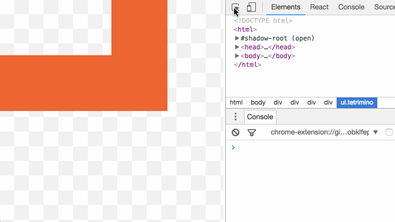

### Creating fixtures

Creating fixtures is fun if you do it from the beginning, but it can be a drag if you already have dozens of components to mock. Here's a quick way to create a fixture from a running app using React Developer Tools inside Chrome:

- Select DOM element of desired component in the Elements tab
- Switch to React tab and select the corresponding component
- Open Console and run `copy($r.props)` or `copy($r.state)` and you'll get a beautiful JSON in your clipboard ([make sure you're in the right frame](https://github.com/facebook/react-devtools/issues/366))
- Paste the contents into file and you've got yourself a fixture

*Disclaimer: This is just a quick way to start experimenting with React Cosmos. Most components expect one or more unserializable props (e.g. callbacks or children) which can't be serialized into JSON.*
