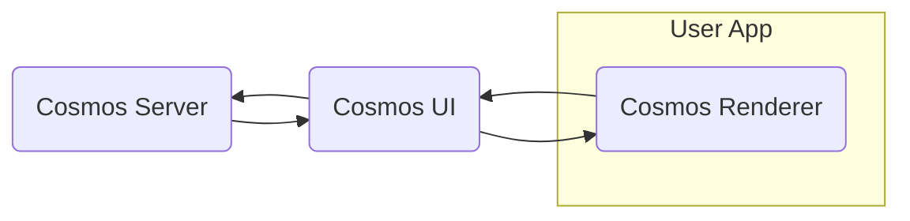

# Architecture

React Cosmos is made out of three main parts: The Server, the Renderer and the UI.

## Cosmos Server

The Cosmos Server is a Node.js app that enables CLI commands for starting the dev server and creating static exports. Its key responsibilities include:

- Reading the Cosmos config (or creating a default one).
- Detecting the user's fixture and decorator module paths.
- Provisioning the Cosmos UI based on user data and serving it.
- Running [Server Plugins](/docs/plugins/server-plugins.md).

Server Plugins are responsible for:

- Wiring up the Cosmos Renderer within the user's toolkit (Vite, Webpack, Metro, etc.)
- Any other functionality that requires a Node.js environment, like accessing the file system and exchanging messages with the Cosmos UI.

## Cosmos UI

The Cosmos UI is a React app that enables users to browse and interact with their fixtures. Its key responsibilities include:

- Allowing users to browse and search through fixtures.
- Connecting with one or more Renderers—through postMessage or WebSocket, and synchronizing the selected fixture and fixture state.
- Running [UI Plugins](/docs/plugins/ui-plugins.md).

UI Plugins are responsible for:

- Useful features that benefits the developer experience, like adding interactive controls for component props and state, previewing components inside responsive viewports, or opening the selected fixture inside the user's default editor.

## Cosmos Renderer

The Cosmos Renderer is a versatile React wrapper that can run in the browser (iframe or new window), in React Native, and even on the server when using React Server Components. Its purpose is to connect your codebase to the Cosmos UI. Its key responsibilities include:

- Connecting to a Cosmos UI through postMessage or WebSocket.
- Importing fixture and decorator modules. Revealing fixture names and reporting the complete fixture list to the Cosmos UI.
- Rendering fixtures on command.
- Synchronizing fixture state with the Cosmos UI (a two-way data flow).
- Providing the React Context needed for [Fixture Plugins](/docs/plugins/fixture-plugins.md).

### Renderer Messages

Messages to and from the Renderer are split into Requests and Responses. The complete list of supported messages can be found [here](https://github.com/react-cosmos/react-cosmos/blob/main/packages/react-cosmos-core/src/renderer/rendererConnect.ts).

> While some requests might be organically followed by a corresponding response, they are asynchronous one-way messages and don't have a direct response as an HTTP call would.
