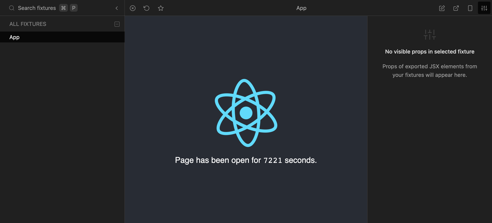

# React Cosmos + Snowpack = ❤️

React Cosmos is a sandbox for developing and testing UI components in isolation. Go to the [main README](https://github.com/react-cosmos/react-cosmos/blob/main/README.md) for more info.

Although it's most commonly used with webpack, Cosmos is made out of composable pieces that can be assembled with any build tool. Cosmos is already used without webpack in React Native projects, and it works with Parcel and Browserify too. _So how about Snowpack?_

Snowpack and Cosmos make a great match. Both focus on developer productivity and complement each other nicely. You get to narrow your focus down to a single component, which refreshes instantly when you make a change without losing state.

## So let's install React Cosmos in a Snowpack codebase

> All the following steps are also included in [this pull request](https://github.com/react-cosmos/react-cosmos-snowpack/pull/1/files), which is part of the [react-cosmos-snowpack](https://github.com/react-cosmos/react-cosmos-snowpack) example repo.

### 1. Install React Cosmos

```bash
# npm
npm install --save-dev react-cosmos
# Yarn
yarn add --dev react-cosmos
```

### 2. Configure React Cosmos

Create a `cosmos.config.json` file in your project root containing the following settings. In the `experimentalRendererUrl` option, adjust the port to your Snowpack port.

```json
{
  "staticPath": "public",
  "userDepsFilePath": "src/cosmos.userdeps.js",
  "experimentalRendererUrl": "http://localhost:8080/_renderer.html"
}
```

Create `index.cosmos.tsx` next to your existing index module.

```jsx
import { mountDomRenderer } from 'react-cosmos/dom';
import { decorators, fixtures, rendererConfig } from './cosmos.userdeps.js';

mountDomRenderer({ rendererConfig, decorators, fixtures });

if (import.meta.hot) import.meta.hot.accept();
```

> If you use TypeScript, you'll have to slap a `@ts-ignore` above the `'./cosmos.userdeps'` import. Sorry about that.

Finally, add `cosmos.userdeps.js` to gitignore. It's a file that Cosmos auto generates at startup that you shouldn't worry about.

### 3. Configure Snowpack

Create `index.cosmos.html` next to your existing index html file. Make it identical to `index.html`, except for the index module, which will point to `/dist/index.cosmos.js`.

```diff
<body>
  <div id="root"></div>
-  <script type="module" src="/dist/index.js"></script>
+  <script type="module" src="/dist/index.cosmos.js"></script>
</body>
```

Add another route to your Snowpack config that points to the Cosmos html.

```js
// snowpack.config.js
routes: [
  // Cosmos renderer URL
  { src: '/_renderer.html', dest: '/index.cosmos.html' },
  // Other routes...
],
```

Enable the `polyfillNode` flag in the `packageOptions` of your Snowpack config.

```js
// snowpack.config.js
packageOptions: {
  polyfillNode: true,
  // Other package options...
},
```

### 4. Start React Cosmos with Snowpack

With this setup, Cosmos requires your regular Snowpack dev server to also be running. This could improve in the future, but for now...

```bash
# Terminal 1 (Snowpack running)
yarn start
# Terminal 2 (Cosmos running at localhost:5000)
yarn cosmos
```

And there you have it 🪄



## Going forward

This is a first pass at integrating React Cosmos with Snowpack. There might be some kinks that need to be ironed out.

In the future Cosmos might run Snowpack behind the hood, without relying on an already running Snowpack server. This could reduce the install steps. I have some other ideas and I also want to hear yours. I'm new to Snowpack, but I love it so far and I'm excited to interact with the Snowpack community.

Feel free to create an issue if you have one, or [join us on Slack](https://react-cosmos.slack.com/join/shared_invite/zt-g9rsalqq-clCoV7DWttVvzO5FAAmVAw#/) to ask questions and brainstorm ideas.
