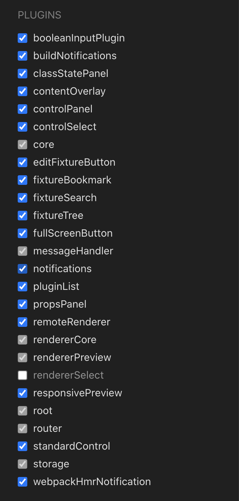
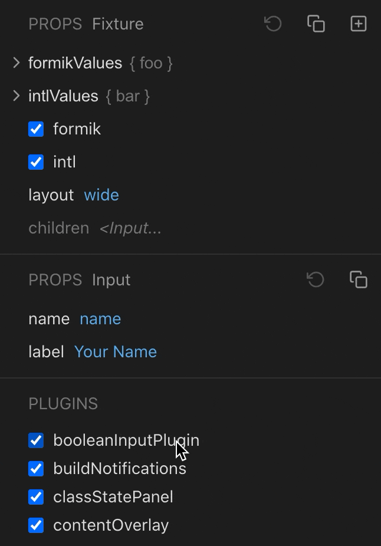

# An early guide to React Cosmos UI plugins

Please understand the following before continuing:

- The UI plugin API is **subject to change**. The Cosmos UI has been running on this plugin system for about 2 years, but the plugin API hasn't been released to the public yet and, based on your feedback, we might want to improve the API before we make it official.
- This document only covers UI plugins. Server plugins will come later.
- This document only covers a _subset_ of the UI plugin API. It explains how to inject a component in certain parts of the UI, but it doesn't yet cover how to communicate with other existing plugins via direct methods and events – that will also come later.
- The UI plugin system uses two external packages, `react-plugin` and `ui-plugin`. These plugins don't have their own documentation yet. The good part is that for now you only need this document to get going :).
- The long term plan is to make a browsable plugin repository and to install plugins without having to open a terminal or restart your Cosmos dev server. _We're not there yet._ As an early adopter you'll need a bit of a hacker mentality to play with Cosmos plugins at this stage of the process. I appreciate the patience!
- This document is work in progress. I'll keep improving it as feedback rolls in.

Jump to

- [Unlock the plugin list](#unlock-the-plugin-list)
- [Check out the example plugin](#check-out-the-example-plugin)
- [Create your own plugin](#create-your-own-plugin)

## Unlock the plugin list

The first thing you can do to get familiar with the UI plugin system is to enable the toggleable plugin list that's already included in the Cosmos UI, but hidden by default.

- **Make sure you're on `react-cosmos@5.5.0-alpha.10` or newer!**

Load the Cosmos UI in any project, open the browser console and run this command:

```js
ReactPlugin.enablePlugin('pluginList', true);
```

Now select any fixture and open the right-side control panel. You should see the plugin list.



> We'll move the plugin list to a dedicated section before we make it official.

You can get a feel of the plugin system by toggling some of the built-in plugins. The essential plugins cannot be disabled as doing so would break everything. But you can still break the UI if you disable a plugin that other enabled plugins depend on. For example if you disable `fixtureTree` before you disable `fixtureSearch`.

## Check out the example plugin

Let's get down to business. In the Cosmos monorepo there is a demo plugin called `booleanInputPlugin`. It's [here](https://github.com/react-cosmos/react-cosmos/tree/ecd4fae5732134292c978fda86832da24ea055c1/example/booleanInputPlugin). You could clone the Cosmos repo to see it running, but maybe you don't want to do that. And it's more fun to install this demo plugin in your own codebase, right? So let's try that.

The compiled plugin isn't versioned, so I created an archive for you to unpack into your project. **[Click here to download](https://github.com/react-cosmos/react-cosmos/raw/80fbcbcbbd352108d551a8b95685e19627d78d1b/docs/uiPlugins/booleanInputPlugin.zip).** It's just one JSON file and one JS file. We'll get into what they do later.

Unzip and put the `booleanInputPlugin` folder anywhere in your project. Just make sure it's located inside your `rootDir` (the dir where you have your cosmos.config.json, or the dir where you run the `cosmos` command if you're flying configless).

### Enable plugins in your project

Plugins are currently disabled by default to avoid performance issues for non-testers until the plugin API matures. Set `disabledPlugins` to `false` in your cosmos.config.json.

```json
{
  "disabledPlugins": false
}
```

Done? Great. Now (re)start Cosmos as you normally do. The plugin should be detected automatically.

If the plugin was detected you should see this message in your terminal:

```
[Cosmos] Found 1 plugin: Boolean input
```

> If you don't see this message or see errors instead please let us know on [Discord](https://discord.gg/3X95VgfnW5).

Now open the Cosmos UI. If the plugin was loaded successfully you should see this message in the browser console:

```
[Cosmos] Loading plugin script at path/to/booleanInputPlugin/ui.js
```

> If you don't see this message or see errors instead please let us know on [Discord](https://discord.gg/3X95VgfnW5).

OK, now the plugin should be in action. Maybe at this point I should tell you what the plugin does! The plugin changes the input for boolean values in the control panel, from a true/false button to a proper checkbox.

In case you don't have any boolean values throughout your fixtures, here's a dummy fixture you can use to add a boolean input to your control panel.

```jsx
// example.fixture.jsx
import { useValue } from 'react-cosmos-renderer/client';

export default () => {
  const [toggle, setToggle] = useValue('toggle me', { defaultValue: false });
  return `Toggled: ${toggle}`;
};
```

And voilà. This is what boolean inputs look like, before and after the plugin is enabled.



> If you don't get the same experience please let us know on [Discord](https://discord.gg/3X95VgfnW5). Hell, even if it _does_ work let us know!

## Create your own plugin

This part is WIP 🙀

I'm working on this and will post updates on Discord. If you're really eager to write your own Cosmos plugin, you can check out the [source code for the booleanInput plugin](https://github.com/react-cosmos/react-cosmos/tree/ecd4fae5732134292c978fda86832da24ea055c1/example/booleanInputPlugin). Here's the absolute minimum you need to know:

- Your plugin needs a `cosmos.plugin.json` file to be automatically detected by Cosmos.
- In the plugin config, the `ui` attribute points to the relative path of the JS file.
- The plugin should be precompiled, as is the Cosmos UI. This is why plugins can be installed without having to build anything locally.
- If you choose to bundle your plugin with webpack (recommended for now), use [this config](https://github.com/react-cosmos/react-cosmos/blob/ecd4fae5732134292c978fda86832da24ea055c1/example/booleanInputPlugin/webpack.config.js) as your boilerplate. The [externals part](https://github.com/react-cosmos/react-cosmos/blob/ecd4fae5732134292c978fda86832da24ea055c1/example/booleanInputPlugin/webpack.config.js#L21-L25) is the most important, because it ensures your plugin reuses the React version already bundled in the Cosmos UI.
- There are two things called **slots** and **plugs**. The Cosmos UI has dozens of slots throughout its components. Plugins can _plug_ into these slots to decorate or replace pieces of UI. This really needs to be explained properly, but you can see how the boolean input plugin replaces just boolean input types [here](https://github.com/react-cosmos/react-cosmos/blob/ecd4fae5732134292c978fda86832da24ea055c1/example/booleanInputPlugin/src/ui.tsx#L14-L29).
- Let us know what you made on [Discord](https://discord.gg/3X95VgfnW5) 🙏

Thank you for being part of this journey.
