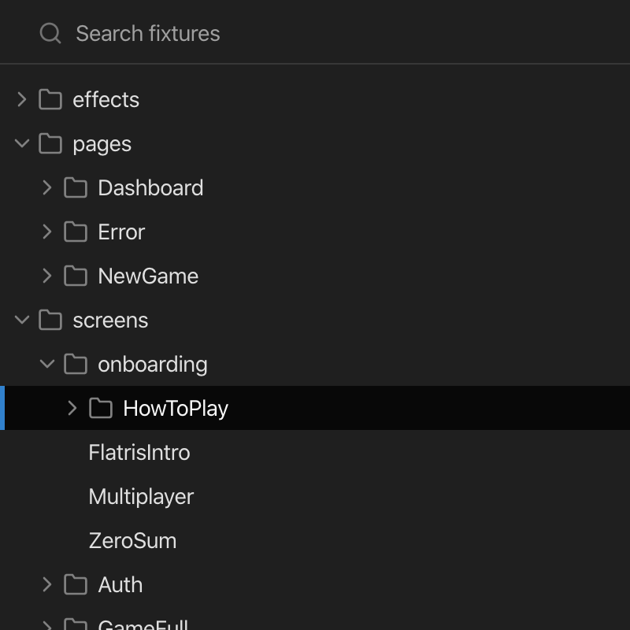
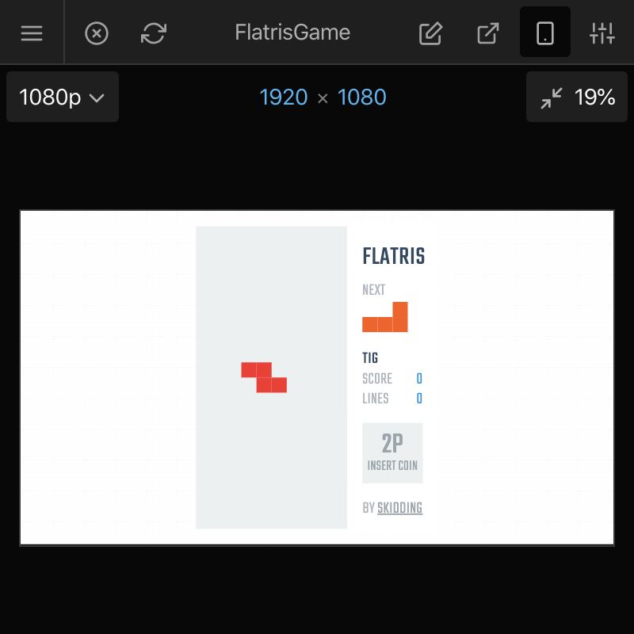

# User Interface

Inspiration: https://twitter.com/ReactCosmos/status/1189127279533793281

## Fixture Tree View

File-system based. Persistent.

### Lazy mode

## Fixture Search

Fuzzy. ⌘ + P from anywhere.

## Fixture Bookmarks

## Responsive Viewport

`<Viewport>` component.

## Full-screen Renderer

## Remote Renderer

Multiple remote renderers (looking at multiple fixture previews).

## Reload Renderer (With Native Support)

## Open Fixture Source

## Control Panel

## Keyboard Shortcuts

## Adjustable Panels

Resizable. Collapsable. Persistent.

## Notifications

## UI Plugins
