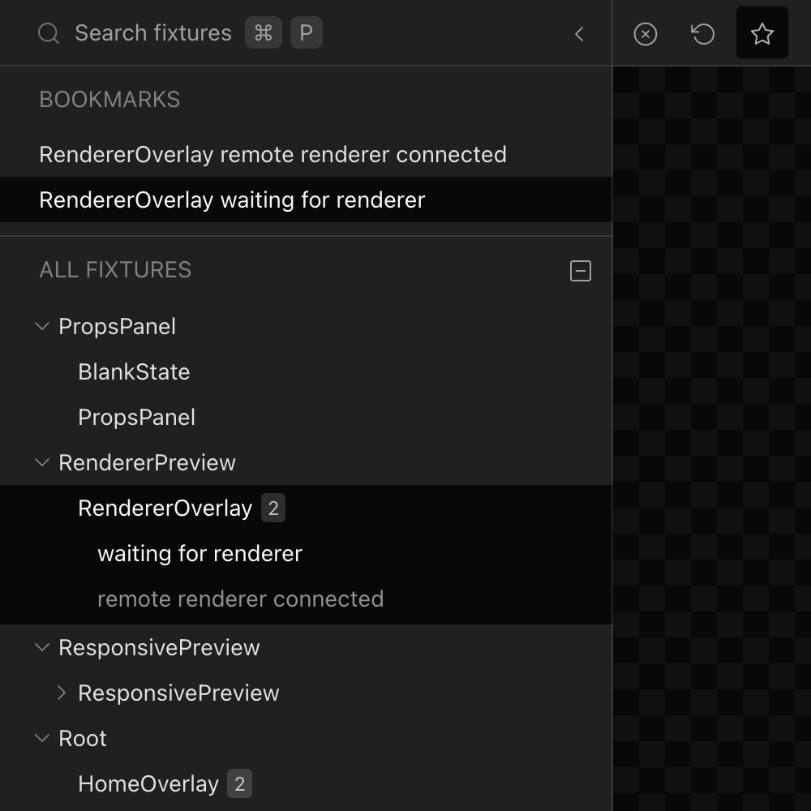

# User Interface

This section highlights the main functionality of the React Cosmos UI.

Visit [reactcosmos.org/demo/](https://reactcosmos.org/demo/) for a live demo of React Cosmos.

## Fixture Tree View

An elegant file-system based tree view navigation system. Folders can be collapsed,
and their state persists between sessions.

## Fixture Search

A snappy fixture search feature with fuzzy matching. Use `⌘ + P` from anywhere to launch the search modal.

## Fixture Bookmarks

A convenient way to keep certain fixtures readily accessible while actively working with them.

## Fixture Preview

The fixture preview is the heart of React Cosmos. It loads a Cosmos renderer in an `iframe` within the Cosmos UI.

Communication and state synchronization between the Cosmos UI and the renderer is accomplished through [`window.postMessage`](https://developer.mozilla.org/en-US/docs/Web/API/Window/postMessage).

## Responsive Preview

WIP.

## Full-Screen Preview

Launch the selected fixture into a full-screen preview, breaking away from the Cosmos UI shell.

> A full-screen preview functions as a [Remote Renderer](#remote-renderer).

## Remote Renderer

You can have multiple remote renderers open simultaneously, allowing you to view the same fixture on different resolutions, browsers, or devices. It's also possible to preview different fixtures concurrently.

State synchronization between multiple renderers is supported, with one primary renderer controlling the state while the others mirror it.

> The React Native renderer operates as a remote renderer, synchronizing its state with the Cosmos UI via `WebSocket`.

## Reload Renderer

The reload renderer button triggers a full reload of the fixture preview. It is particularly useful for React Native apps, as it invokes `DevSettings.reload` within the renderer.

## Open Fixture Source

Launches the source code of the current fixture in your default code editor.

> **Note** You need to install the [Open Fixture Plugin](../plugins/cosmos-plugins.md#open-fixture-plugin) to enable this capability.

## Control Panel

The UI controls provide powerful component data manipulation capabilities.

Three types of panels are currently supported:

1. Props Panel: Automatically generated based on React element props. Only works with [Node Fixtures](../usage/fixtures.md#node-fixtures).
2. Class State Panel: Automatically generated based on React Class components, which are deprecated but still supported indefinitely.
3. Controls Panel: Generated using custom definition hooks that can be represented as text inputs or select dropdowns.

## Adjustable Panels

The Cosmos UI features two slick resizable and collapsible panels on each side. Their state persists between sessions.

## Notifications

A beautiful notifications interface used to communicate renderer and server connectivity. It can be utilized from anywhere in the Cosmos UI, including 3rd party plugins.

## Keyboard Shortcuts

The Cosmos UI supports a set of useful keyboard shortcuts for the most commonly used actions:

| Shortcut    | Action               |
| ----------- | -------------------- |
| `⌘ + P`     | Search fixtures      |
| `⌘ + ⇧ + P` | Toggle fixture list  |
| `⌘ + ⇧ + K` | Toggle control panel |
| `⌘ + ⇧ + E` | Edit fixture         |
| `⌘ + ⇧ + F` | Go full screen       |

## UI Plugins

The Cosmos UI can be extended using the [UI Plugin API](../plugins/ui-plugins.md).

---

[Join us on Discord](https://discord.gg/3X95VgfnW5) for feedback, questions and ideas.
