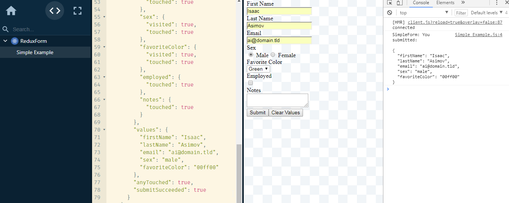

This example is based on [Redux Form - Simple Example. A simple vanilla form written with redux-form by erikras](https://codesandbox.io/s/mZRjw05yp)

> Run `yarn` in the root directory first. Then you can run `yarn start` inside any example directory.

```
cd ./examples/redux
yarn start
```

Go to http://localhost:8989 and show the browser console and the react-cosmos editor. 



All changes to the form will be displayed in the state editor.
